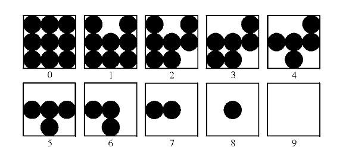
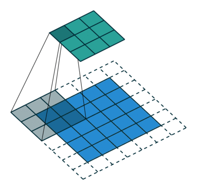
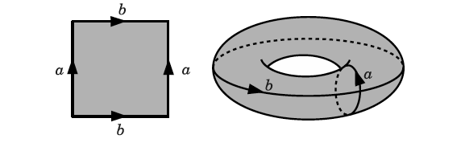

# IN1076 Capstone

Final project for IN1076 @ CIN - UFPE, 2020.1.

This project aims at implementing a basic image processing tool without relying on image processing methods found in several libraries.

## Requirements

We use:

- Open CV: To read and write images. Installation:

        pip install opencv-python

- argparse and sys: To parse command line arguments. Installation:

        pip install argparse

- Matplotlib and pylab: To display the output. Installation:

        pip install matplotlib

- Numpy: Used to store arrays. Installation:

        pip install numpy

- tqdm: Used to generate progress bars. Installation:

        pip install tqdm

- functools: The `reduce` method was used to find the minimum and maximum values of grayscale images. Installation:

        pip install functools

There are two Python 3.x files, `image.py` and `proc_image.py`,  the former containing all the methods implemented and a test client, while the latter is the main application.

### Disclaimer

The program is not optimized, performance-wise.

## Using the program

To use this program run:

    python proc_image.py <path to image> <process name> <save>

### Example

    python proc_image.py ~/Desktop/cat.jpg gaussian False

The processed image will **always** be displayed when the processing is done.

## Using the test client

The test client calls every image processing method implemented and displays the output. By default, it uses test.png included in this project and will not save any output. Run it with

    python image.py

Finally, run `python proc_image.py -h` if you need help.

## Remarks

- List of allowed boolean values for `<save>`:

  `True`: true, yes, t, y, 1, True, TRUE. In general, any v satisfying v.lower() == true.

  `False`: false, no, f, n, 0, False, FALSE. In general, any v satisfying v.lower() == false.

   Check `str2bool` in `image.py` for more.

- The outputs are saved in the same directory you run the program.

## Tools

The image processing tools available and their respective names (you should use theses names when running the program) are given below:

- Grayscale filter (`grayscale`): Converts an RGB image into grayscale using the luminance of a pixel. The luminance Y is calculated using the formula Y = 0.299r + 0.587g + 0.114b where r, g, and b are the pixel values for the red, green, and blue channels, respectively.

- Halftone (`halftone`): Converts the range of a grayscale image to [0, 9], and for each pixel value performs a mapping according to the following image from this [reference](http://www.imageprocessingplace.com/DIP-3E/dip3e_student_projects.htm#02-01). The output is a black & white picture that resembles a grayscale picture with lower resolution. Due to this mapping, halftoned images have three times the width and three times the height of the original image.

- Mean blur (`mean`): Takes an average of 3 x 3 regions.

- Gaussian blur (`gaussian`): Takes a weighted average of a 3 x 3 region using a gaussian function.

- Sharpen (`sharpen`): Sharpens the image. Formally, substracts the 4-neighbors laplacian from the original image.

- Laplacian (`laplacian`): Returns the 8-neighbors laplacian applied to the image.

- Emboss (`emboss`): Enhance image emboss.

- Motion blur (`motion`): Blurs the image as if it is moving.

- Edge detectors (`y_edge`, `x_edge`): Sobel filters to detect vertical and horizontal edges, respectively.

- Brighten (`brighten`): Brightens the image by 25%.

- Darken (`darken`): Darkens the image by 25%.

- Identity (`identity`): Returns the original image.

- 90 degrees rotation (`rot90`): Rotates the image 90 degrees clockwise.

- 180 degrees rotation (`rot180`): Rotates the image 180 degrees.

- Minus 90 degrees rotation (`rotm90`): Rotates the image 90 degrees counterclockwise (or 270 degrees clockwise).

- Vertical flip (`vert_flip`): Produces a mirrored image.

- Horizontal flip (`hor_flip`): Vertical flip and 180 degrees rotation combined.

- Downscale (`downscale`): Reduces image size by a factor of 2.

- Negative (`negative`): Produces the negative of an image.

## Convolution | Cross-correlation

The function apply_kernel in `image.py` implements the cross-correlation. It is similar to a convolution, without needing to "rotate" the kernels. All of the kernel matrices are already "rotated".  In that case, the cross-correlation with the given kernel is, by definition, the convolution needed to process the image.

### Remark

It was used the so-called *periodic boundary condition*, much like the torus below.

